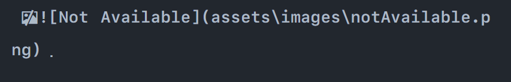

# How to Write Blog Posts in Markdown

Writing a blog post or an article for publications like [Adam the Automator](https://adamtheautomator.com/) requires the use of Markdown. This article will list out the basic Markdown with its syntax and expound on each of those syntaxes.

## Markdown

According to [Wikipedia](https://en.wikipedia.org/wiki/Markdown), Markdown is a lightweight markup language for creating formatted text using a plain-text editor. It helps to format plain text with little stress. Markdown is simpler and easier to use compared to HTML which is more complex. There are lots of syntaxes in HyperText Markup Language (HTML) which makes it  difficult to learn for beginners, but Markdown is way easier for text formatting.

## Prerequisite

The prerequisite for this tutorial doesn't demand much. Basically, you should know how to read and write, obviously, and you should have a Markdown Editor, [Typora](https://typora.io/) preferably. Having a little knowledge of HTML would help, but you can still carry on with the tutorial having no issues. If all is correct, the next step is to dive into the purpose of this article.

### Headings

Creating a blog post or an article always kicks off  with a heading. The first heading in a blog post tells the reader the purpose of writing the blog. Other Headers are used to indicate what the next section of the blog post entails.<br/>There are six (6) headings in Markdown ranging from `heading1` to `heading6`, similar to what we have in [`HTML`](https://www.markdownguide.org/basic-syntax/).  `Heading1` in size is the biggest heading then it reduces in size down to `heading6`, which is the smallest amongst them.<br/>Headers in Markdown are written using hash (`#`) characters. `Heading1` is written using one hash (`#`) character. The same goes for `heading2` with two (2) hash (`##`) characters down to `heading6` with six (6) hash characters.

```markdown
# This is heading one
## This is heading two
### This is heading three
#### This is heading four
##### This is heading five
###### This is heading six
```

The block of Markdown above shows the syntax of how heading sections are addressed and how  the different headings are written. A screenshot of the output gotten from writing the Markdown is shown below:


The output above shows how the headings reduce in size from `heading1` down to `heading6`.  Any other header apart from the ones mentioned above would be displayed as plain text.

> When writing headings in markdown, make sure there is a space between the hash character(s) and the title to get the desired output.

### Paragraphs

Paragraphs are a group of words or groups of sentences that explain a particular idea or a topic. Most blog post writers start paragraphs with an indentation on a new line or without indentation. <br/>In [Typora](https://typora.io/), pressing the `Return` key would create a new paragraph. Most Markdown editors support the use of `Shift` + `Return` to create a single Line break or `<br/>` for editors that support HTML. Line breaks are applied to separate different ideas or different sections in a blog post.

```markdown
This is paragraph 1

This is paragraph 2 with a blank line
This is paragraph 3 without a blank line<br/>
This is paragraph 4 using `br`
```

The illustration of how paragraphs in [Typora](https://typora.io/) are written is shown above.  A screenshot of the above Markdown's output is added below:


Paragraphs are displayed as plain text unless styles are added to change the display. Speaking on styles, the next section covers the styles in Markdown.

### Emphasis

In Markdown, emphasis stresses a word or a phrase and makes it stand out from the rest in a sentence or a section. _Italic_ and **Bold** are two (2) ways of emphasizing words or phrases in Markdown.<br/>There are various syntaxes in writing _Italic_ and **Bold**.

#### Bold

There are two methods of making a text bold. The first is the use of double asterisks and making use of double underscore is the second method:

```markdown
I Love **Adam** The Automator
I Love __Adam The Automator__
I**Love**Adam
I__Love__Adam
```

In the first line of Markdown double asterisks made `Adam` bold, and the rest displayed as normal text. Phrases can also be made bold as illustrated in line two, but this time the second method, double underscore, is implemented.<br/>Output:


A letter or group of letters can also be bold using both the asterisk (*) and the underscore (_) shown in lines three and four of the Markdown code. Don't mind the red underline in the output 😀.

#### Italics

The method for writing italic is almost the same thing as writing bold. Italic makes use of single asterisk and single  underscore compare to bold that makes use of double:

```markdown
I *Love* Adam
I _Love_ Adam
I_Love_Adam
I*Love*Adam
```

The first and second lines of the above code block made the word `Love` *Italic* using a single asterisk and underscore, respectively.

Output:


Using a single underscore to make a letter or group of letters italic would most likely not work. Most Markdown editors like Typora don't support the use of underscore to make letters italic. These editors might see `I_Love_Adam` as a naming convention and would ignore it. <br/>Don't mind the red underline in the output 😀 .

#### Honorable Mention

A text can be bold and italic at the same time by using three asterisks (*) or three underscores (_).

```markdown
I ***really*** Love Adam
I really Love ___Adam___
```

Output:


Markdown also supports the use of double tilde (~~) to strike through texts. Surrounding the text with double tildes would strike through the text.

```markdown
I ~~hate~~ Love Adam
```

Output:


### Blockquotes

Blockquotes are sections in a blog post that specify quotes from another source. Adding a text from another author or anther source without enclosing it in a blockquote can call for plagiarism.<br/>Markdown makes use of the angle bracket `>` character to add quotes:

```markdown
> This blog is a place where system administrators, IT professionals, automation engineers, developers, and all tech geeks can learn. ATA is all about learning and is the number one priority of all content we create.
```


Output:


The above text is gotten from [ATA](https://adamtheautomator.com/friends/) website and it is placed in a blockquote to avoid plagiarism.

### Links

Adding links to a specific URL in Blog posts is supported in Markdown. Making use of square bracket `[]` and HTML's link tag are allowed in Markdown for adding links:

```markdown
Want some Awesome articles? [ATA](https://adamtheautomator.com/ "ATA Official Website") is the best place to find them

Want some Awesome articles? <a href="https://adamtheautomator.com/">ATA</a> is the best place to find them
```

In the first line, the square bracket's style is used. The square bracket contains the name of the URL and the parenthesis contains both the URL and the title of the URL. The name displays as the link while the title displays after hovering on the link.

Output:


In the second line, the `href` contains the URL, and the name of the link is bounded with the link tag `<a>ATA</a>`. HTML link tag doesn't display a title on hover, so the best practice in creating a link in Markdown is to make use of the square bracket syntax.

### Lists

Markdown support various of type list formatting which includes Ordered, Unordered, and Task list formatting.

#### Ordered List

Each item in this type of list is numbered from 1 to the total number of items in the list:

```markdown
### Ordered list
1. Item one
2. Item two
3. Item three
```

Output:


After creating an item in an Ordered or Unordered style of list, pressing the `Return` key would automatically give the next number or bulletin to the new item on the list. Most  Markdown editors support this, while other editors would ignore it.

#### Unordered List

This makes use of bulletin in listing out each item on the list:

```markdown
### Unordered list
- Item one
* Item two
+ Item three
```

Output:


The Unordered list can be formatted by using `-`, `*` or `+` characters. Using any of the characters would lead to the same result.

#### Task List

It contains a list of activities that are completed or yet to be completed. An empty square bracket `[ ]` marks the activity as not completed, while `[x]` marks that activity as completed:

```markdown
### Task list
- [ ] Task one
- [x] Task two
- [ ] Task three
```

Output:


There is a difference between the link square bracket and that of the task list. Task lists start with a hyphen `-`, but links don't start with one.

### Code Blocks

This section contains source code of a particular programming language. Markdown uses three backtick `(```)` characters in creating code blocks:

````markdown
```javascript
const ata = "Adam is the best"
console.log(ata)
```
````

Output:


The source code is bounded each side by three backticks. Different source code can be added in Markdown because it supports various programming languages. The programming language is specified after the backticks above the source code as shown in the markdown code.

### Images

Adding images is similar to adding links, but images requires an exclamation `!` character before defining the image:

```markdown


```

In the above code, the square bracket contains a text that only displays when the path to the image is invalid., while the parenthesis contains the path to the image.

Output:




The second image has an invalid path so it returned a broken image icon with image code. Typora display inaccessible image as shown in the second output, while other Markdown editors shows a broken image icon and the alternative text:


## Conclusion

Wow, you've done great to stay till end. At this point you should know how to write in markdown using  the basic syntaxes.<br/>Looking for amazing articles? Search no more, you can get these amazing articles from [ATA](https://adamtheautomator.com/ "ATA Official Website").

Till we cross path, I remain Fredrick Emmanuel (divofred)😁😁❤❤.
